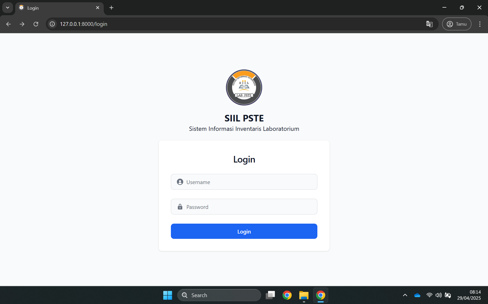
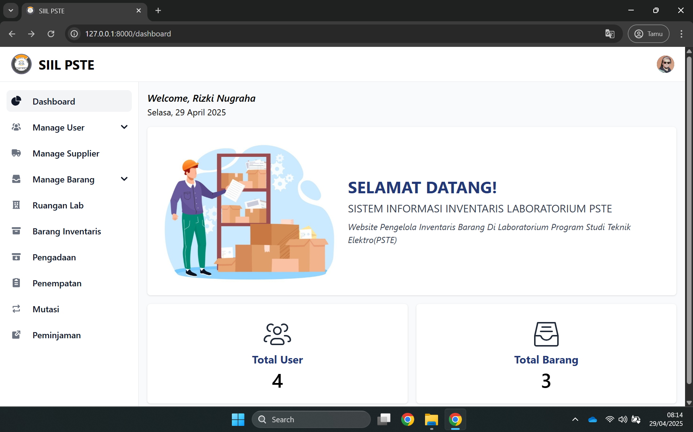
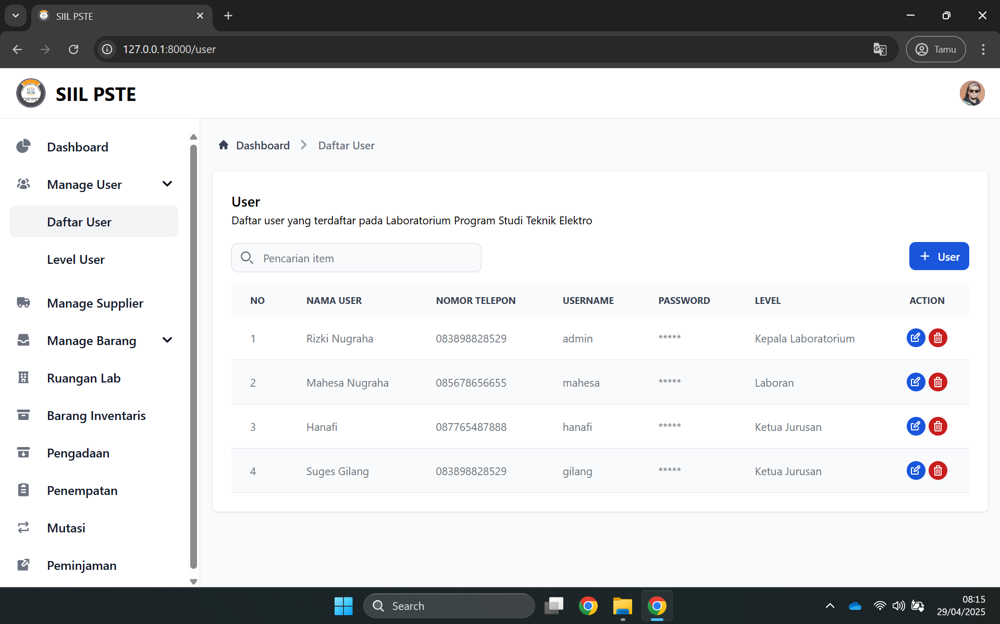
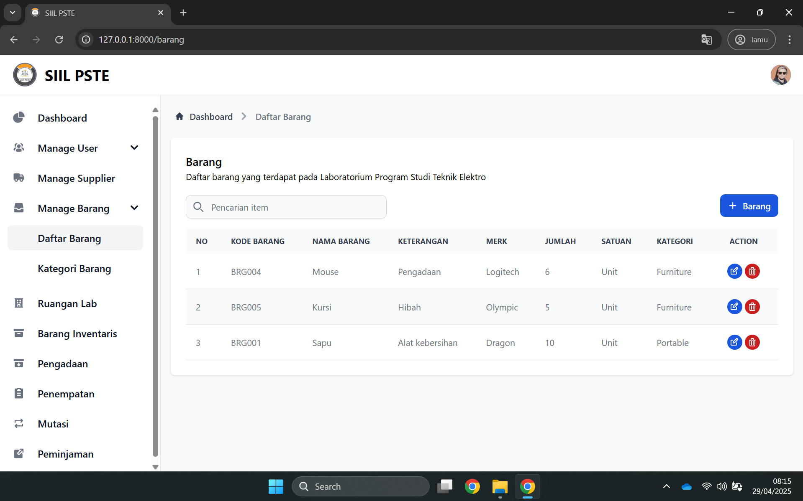
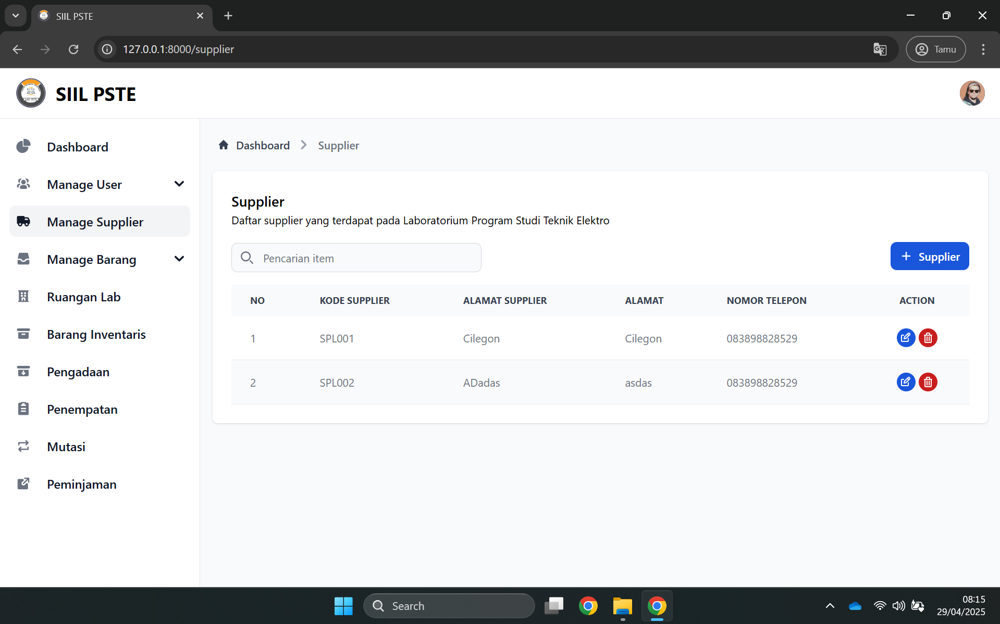
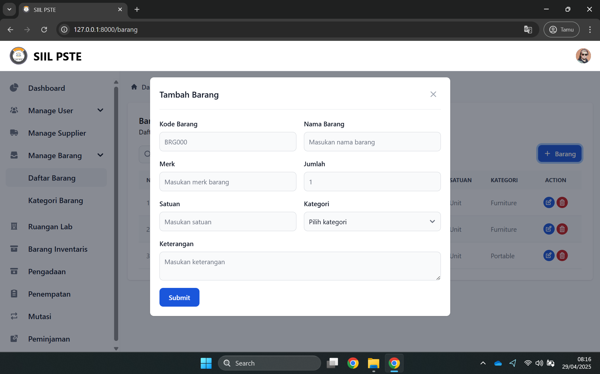
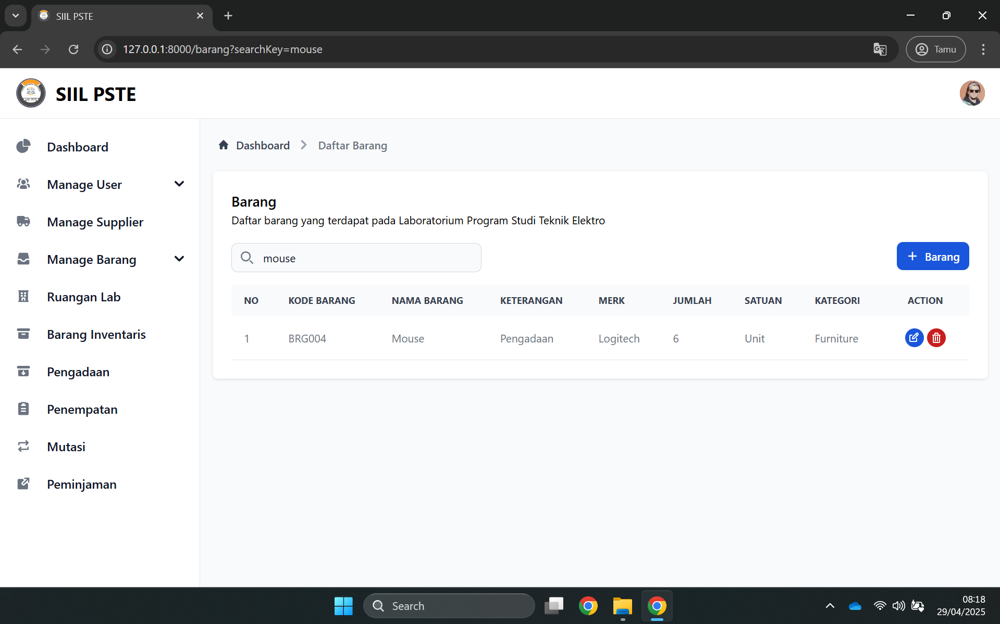
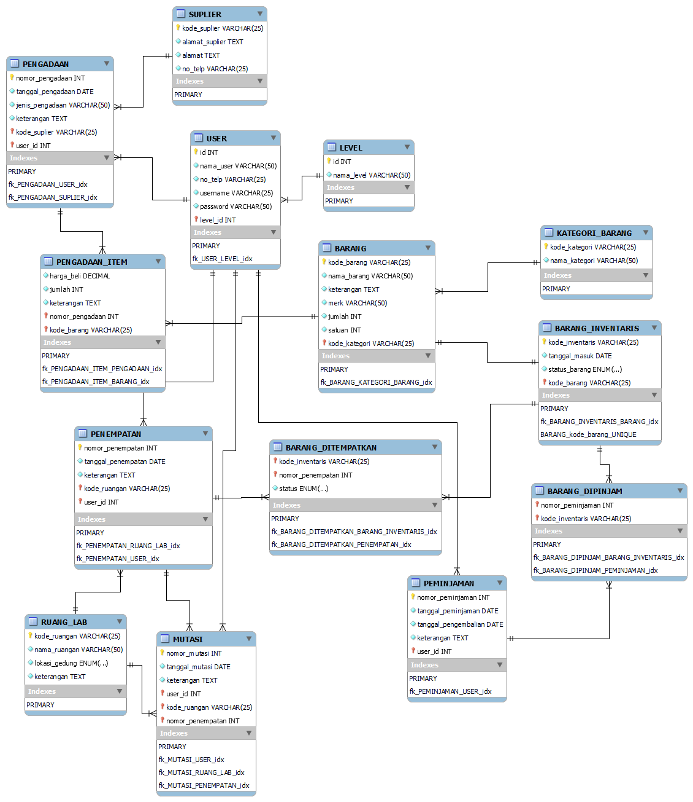

# Inventory System 📦

## 📋 Project Overview
This project is a inventory management system designed specifically for electrical engineering department laboratories. The system aims to streamline the tracking of laboratory equipment, components, and supplies while providing an intuitive interface for staff and students. Built with modern web technologies, this application offers a robust solution for managing laboratory assets, tracking usage, and maintaining supplier information.

This project was created as part of a college database design course to address the real-world need for efficient inventory management in electrical engineering laboratories. Traditional paper-based inventory methods or generic inventory systems often fail to address the unique requirements of electrical engineering labs, such as tracking specialized components, managing equipment calibration schedules, and monitoring the usage of consumable supplies. This system was built to fill that gap and provide a tailored solution that improves operational efficiency, reduces equipment downtime, and helps maintain adequate stock levels of critical components.

## ✨ Key Features
- **User Authentication & Authorization**: Secure login system with role-based access control
- **Inventory Management**: Track laboratory equipment, components, and supplies
- **User Management**: Admin dashboard to manage system users and their permissions
- **Supplier Directory**: Maintain and access supplier contact information
- **Search Functionality**: Quickly find items in the inventory with advanced filtering
- **Responsive Design**: User-friendly interface accessible on various devices
- **Modal Forms**: Intuitive forms for adding and editing inventory items
- **Database Integration**: Robust MySQL database with optimized schema design

## 🖼️ Preview

### Login Screen

### Dashboard

### User Management

### Inventory Items

### Supplier Management

### Item Entry Form

### Search Functionality

### Database Design

### Complete Mockup
[View Full Figma Mockup](https://drive.google.com/file/d/1kogj5yKyyR48F4PgfXbCA97CmMayh413/view?usp=sharing)

## 🛠️ Technologies
- **Frontend** 💻:
  - HTML5, CSS3, JavaScript
  - Tailwind CSS for responsive design
  - Figma for UI/UX design and prototyping

- **Backend** 🔧:
  - Laravel PHP Framework
  - RESTful API architecture
  - Authentication middleware

- **Database** 💾:
  - MySQL
  - MySQL Workbench for database design and ERD creation

## 🚀 Future Improvements
- **Barcode/QR Code Integration**: For quick scanning and tracking of inventory items
- **Equipment Reservation System**: Allow users to reserve equipment for specific time slots
- **Maintenance Tracking**: Record and schedule maintenance activities for laboratory equipment
- **Reporting Module**: Generate detailed reports on inventory status, usage patterns, and procurement needs
- **Mobile Application**: Develop a companion mobile app for on-the-go inventory management
- **Notification System**: Automated alerts for low stock, maintenance due dates, etc.
- **Bulk Import/Export**: Feature to bulk upload or download inventory data
